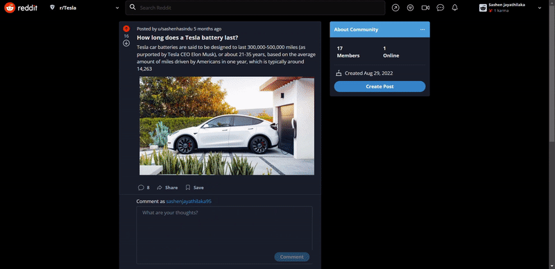
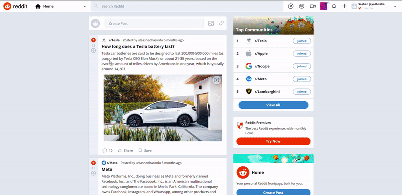

<div align="center">

  
  
  <h1>Reddit Clone with REACT.JS</h1>
  
  <p>
Reddit Clone with REACTJS (Next.js, Firebase v9, Chakra UI, TypeScript, Recoil, (Image Uploading, Google Authentication, Create Community, Join Community, Leave Community, Upvote and Downvote Posts), Dark Mode & Light Mode, Data Encryption and Decryption)
  </p>
  
  
<!-- Badges -->

<a href="https://reddit-sclone.vercel.app" target="_blank"></a>


<h4>
    <a href="https://reddit-sclone.vercel.app">View Demo</a>
  <span> · </span>
    <a href="https://github.com/SashenJayathilaka/Reddit-Clone/blob/master/README.md">Documentation</a>
  <span> · </span>
    <a href="https://github.com/SashenJayathilaka/Reddit-Clone/issues">Report Bug</a>
  <span> · </span>
    <a href="https://github.com/SashenJayathilaka/Reddit-Clone/issues">Request Feature</a>
  </h4>
</div>

<br />

<!-- Table of Contents -->

## :notebook_with_decorative_cover: Table of Contents

- [About the Project](#star2-about-the-project)
  - [Screenshots](#camera-screenshots)
  - [Tech Stack](#space_invader-tech-stack)
  - [Environment Variables](#key-environment-variables)
- [Getting Started](#toolbox-getting-started)
  - [Prerequisites](#bangbang-prerequisites)
  - [Installation](#gear-installation)
  - [Run Locally](#running-run-locally)
  - [Deployment](#triangular_flag_on_post-deployment)
- [Contact](#handshake-contact)

<!-- About the Project -->

## :star2: About the Project

<!-- Screenshots -->

### :camera: Screenshots

- Create Community, Join Community, Leave Community, Upvote and Downvote Posts

<div align="center">
<a href="https://reddit-sclone.vercel.app"></a>
</div>

<br />

- Dark Mode & Light Mode

<div align="center">
<a href="https://reddit-sclone.vercel.app"></a>
</div>

<br />
  
- User Profile Section
  
<div align="center">
<a href="https://reddit-sclone.vercel.app"></a>
</div>

<br />
  
- Conversation Section (Reddit Clone Live Chat)
  
<div align="center">
<a href="https://reddit-sclone.vercel.app"></a>
</div>

## <a href="https://reddit-sclone.vercel.app" target="_blank">LIVE DEMO 💥</a>

#### 🔴 Open the camera app on your device and scan the code below (live demo)

<a href="https://reddit-sclone.vercel.app"></a>
<a href="#instagram"></a>


### :space_invader: Tech Stack

<details>
  <summary>Client</summary>
  <ul>
    <li><a href="https://#/">Typescript</a></li>
    <li><a href="https://nextjs.org/">Next.js</a></li>
    <li><a href="https://reactjs.org/">React.js</a></li>
    <li><a href="https://chakra-ui.com/">Chakra UI</a></li>
  </ul>
</details>

<details>
<summary>Database</summary>
  <ul>
    <li><a href="https://firebase.google.com">Firebase</a></li>
  </ul>
</details>

<details>
  <summary>Functions</summary>
  <ul>
    <li><a href="https://firebase.google.com/docs/functions">Cloud Functions for Firebase</a></li>
  </ul>
</details>

<br />

<table>
    <tr>
        <td>
<a href="#"></a>
        </td>
                        <td>
<a href="#"></a>
        </td>
                        <td>
<a href="#"></a>
        </td>
                                <td>
<a href="#"></a>
        </td>
                                <td>
<a href="#"></a>
        </td>
                                      <td>
<a href="#"></a>
        </td>
    </tr>
</table>

## :toolbox: Getting Started

### :bangbang: Prerequisites

- Sign up for a Firebase account <a href='https://firebase.google.com'>HERE</a>
- Install Node JS in your computer <a href='https://nodejs.org/en/'>HERE</a>

<!-- Env Variables -->

### :key: Environment Variables

To run this project, you will need to add the following environment variables to your .env file

`NEXT_PUBLIC_FIREBASE_API_KEY`

`NEXT_PUBLIC_FIREBASE_AUTH_DOMAIN`

`NEXT_PUBLIC_FIREBASE_PROJECT_ID`

`NEXT_PUBLIC_FIREBASE_STORAGE_BUCKET`

`NEXT_PUBLIC_FIREBASE_MESSAGING_SET`

`NEXT_PUBLIC_FIREBASE_APP_ID`

`NEXT_PUBLIC_BASE_URL`

`NEXT_PUBLIC_CRYPTO_SECRET_PASS`

This project was bootstrapped with [Create React App](https://github.com/facebook/create-react-app).

### :gear: Installation


Install my-project with npm

```
npx create-next-app@latest --ts my-project
```

```
cd my-project
```

Install dependencies

### In your Next.js project, install Chakra UI


#### Installation

In your Next.js project, install Chakra UI by running either of the following:

```
npm i @chakra-ui/react @emotion/react@^11 @emotion/styled@^11 framer-motion@^6
or
yarn add @chakra-ui/react @emotion/react@^11 @emotion/styled@^11 framer-motion@^6
```

Provider Setup
After installing Chakra UI, you need to set up the `ChakraProvider` at the root of your application.

Go to `pages/_app.js` or `pages/_app.tsx` (create it if it doesn't exist) and wrap the `Component` with the `ChakraProvider`:

```tsx
// pages/_app.js
import { ChakraProvider } from "@chakra-ui/react";

function MyApp({ Component, pageProps }) {
  return (
    <ChakraProvider>
      <Component {...pageProps} />
    </ChakraProvider>
  );
}

export default MyApp;
```

<a href="https://chakra-ui.com/getting-started/nextjs-guide" target="_blank">🔷 Customizing theme & More</a>

Install dependencies

<a href="https://github.com/SashenJayathilaka/Reddit-Clone/blob/master/package.json" target="_blank">🔶 Dependency Info</a>

<!-- Run Locally -->

### :running: Run Locally


Clone the project

```bash
  git clone https://github.com/SashenJayathilaka/Reddit-Clone.git
```

change directory

```bash
  cd Reddit-Clone
```

Install dependencies

```bash
  npm install
```

Start the server

```bash
  npm run dev
```

<hr />

This is a [Next.js](https://nextjs.org/) project bootstrapped with [`create-next-app`](https://github.com/vercel/next.js/tree/canary/packages/create-next-app).

<hr />

Open [http://localhost:3000](http://localhost:3000) with your browser to see the result.

You can start editing the page by modifying `pages/index.js`. The page auto-updates as you edit the file.

[API routes](https://nextjs.org/docs/api-routes/introduction) can be accessed on [http://localhost:3000/api/hello](http://localhost:3000/api/hello). This endpoint can be edited in `pages/api/hello.js`.

The `pages/api` directory is mapped to `/api/*`. Files in this directory are treated as [API routes](https://nextjs.org/docs/api-routes/introduction) instead of React pages.

### Learn More

To learn more about Next.js, take a look at the following resources:

- [Next.js Documentation](https://nextjs.org/docs) - learn about Next.js features and API.
- [Learn Next.js](https://nextjs.org/learn) - an interactive Next.js tutorial.

You can check out [the Next.js GitHub repository](https://github.com/vercel/next.js/) - your feedback and contributions are welcome!

<!-- Deployment -->

### :triangular_flag_on_post: Deployment

To deploy this project run

##### Deploy on Vercel


The easiest way to deploy your Next.js app is to use the [Vercel Platform](https://vercel.com/new?utm_medium=default-template&filter=next.js&utm_source=create-next-app&utm_campaign=create-next-app-readme) from the creators of Next.js.

Check out our [Next.js deployment documentation](https://nextjs.org/docs/deployment) for more details.

## :handshake: Contact

Sashen - [@twitter_handle](https://twitter.com/SashenHasinduJ) - sashenjayathilaka95@gmail.com

Project Link: [https://github.com/SashenJayathilaka/Reddit-Clone.git](https://github.com/SashenJayathilaka/Reddit-Clone.git)

<hr />
